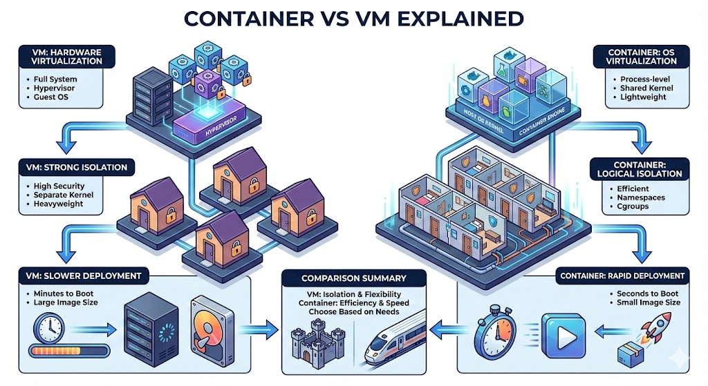

# **The Infrastructure Showdown: Why Your Code Lives Where It Does**

## **The 10-Second Insight**

Virtual Machines (VMs) provide full-system isolation by virtualizing hardware, while Containers provide process-level isolation by sharing the host’s OS kernel for maximum efficiency.

## **Why It Matters**

* **Resource Efficiency:** Traditional VMs carry the heavy tax of a full Guest OS, whereas containers allow you to pack 10x more services on the same hardware.
* **Deployment Velocity:** Containers boot in seconds, enabling modern CI/CD pipelines and instant scaling that VMs simply can't match.
* **Environment Parity:** Containers eliminate the "it works on my machine" problem by bundling every dependency into a single, immutable artifact.

## **The Core Pillars**

1. **Hardware vs. OS Abstraction:** A **Hypervisor** (for VMs) creates multiple isolated virtual hardware sets, while a **Container Engine** (like Docker) leverages Linux namespaces and cgroups to slice up the existing Operating System.
2. **The Guest OS Burden:** Every VM requires a complete **Guest Operating System** (GBs of storage/RAM), whereas Containers share the **Host Kernel**, making them incredibly lightweight and fast.
3. **Security Boundaries:** VMs offer **Strong Isolation** because they don't share a kernel; Containers offer **Logical Isolation**, which is highly efficient but requires more careful configuration to prevent "container breakouts."

## **Real-World Analogy**

* **Virtual Machines are like Houses:** Each has its own plumbing, heating, and foundation; they are completely self-contained but expensive to build.
* **Containers are like Apartment Units:** They share the same underlying infrastructure (plumbing, electrical, foundation) but have their own private front doors and living spaces; they are much cheaper and faster to "move into."

## **The Bottom Line**

Choose VMs for total isolation and running diverse operating systems, but use Containers to build scalable, portable, and lightning-fast microservices.
