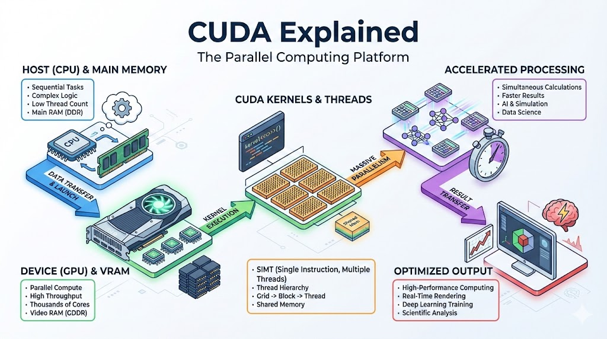

# **CUDA: Breaking the CPU Speed Limit with Massively Parallel Compute**

## **The 10-Second Insight**

CUDA (Compute Unified Device Architecture) is NVIDIA’s parallel computing platform that allows developers to offload math-heavy tasks from the CPU to the GPU, unlocking thousands of cores for general-purpose processing.

## **Why It Matters**

* **Overcoming the CPU Bottleneck:** While CPUs are optimized for complex branch logic and sequential tasks, they lack the raw throughput needed for modern AI and physical simulations.
* **Unprecedented Scalability:** It transforms a graphics card into a high-performance supercomputer, capable of handling millions of simultaneous mathematical operations.

## **The Core Pillars**

1. **The Hierarchy of Threads:** CUDA organizes work into **Threads, Blocks, and Grids**. Thousands of threads are grouped into blocks, allowing the GPU to manage resources efficiently and scale across different hardware generations.
2. **Kernel Execution:** A **Kernel** is the specialized function written by the programmer that runs in parallel on the GPU. Unlike a standard C function, when a kernel is "launched," it is executed thousands of times simultaneously by different threads.
3. **Memory Management:** Effective CUDA programming relies on managing the **Memory Space hierarchy**, specifically moving data between the Host (CPU RAM) and the Device (VRAM). Success is defined by maximizing "Shared Memory" usage to minimize high-latency trips to Global Memory.

## **Real-World Analogy**

Think of a **CPU as a high-speed Ferrari** driven by a single expert who can run complex errands across town very quickly. Think of a **GPU (via CUDA) as a massive fleet of 5,000 bicycles**: they are individually slower than the Ferrari, but if you need to deliver 5,000 pizzas at the exact same time, the fleet of bicycles will finish the job hours before the Ferrari can make 5,000 round trips.

## **The Bottom Line**

CUDA is the bridge that turned the GPU from a specialized gaming component into the primary engine driving the modern AI and Data Science revolution.
