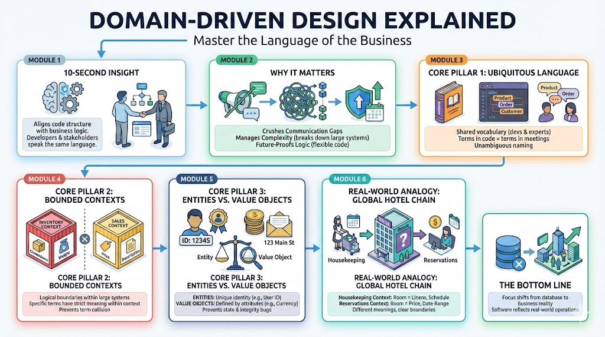

# Stop Building Monoliths: Master the Language of the Business with DDD

## The 10-Second Insight

Domain-Driven Design (DDD) is a strategic software approach that aligns your code structure with the complex business logic it serves, ensuring developers and stakeholders speak the exact same language.

## Why It Matters

* **Crushes Communication Gaps:** Eliminates the "lost in translation" errors between what business experts need and what engineers build.
* **Manages Complexity:** Breaks down massive, tangled systems into smaller, manageable pieces that can evolve independently.
* **Future-Proofs Logic:** Ensures that as the business changes, the code remains flexible rather than becoming a brittle "Big Ball of Mud."

## The Core Pillars

1. **Ubiquitous Language:** This is the practice of using a common, shared vocabulary between developers and domain experts. Every term used in a meeting must appear directly in the class names, methods, and variables of the source code.
2. **Bounded Contexts:** DDD divides large systems into logical boundaries where specific terms have a strict, unambiguous meaning. For example, a "Product" in the **Inventory Context** has dimensions and weight, while in the **Sales Context**, it only has a price and description.
3. **Entities vs. Value Objects:** **Entities** are defined by a unique identity that persists over time (like a User ID), whereas **Value Objects** are defined only by their attributes (like a Currency or Address). This distinction prevents bugs related to state management and data integrity.

## Real-World Analogy

Think of a **Global Hotel Chain**. To the **Housekeeping Department**, a "Room" is a set of linens and a cleaning schedule; to the **Reservations Department**, that same "Room" is a price point and a date range. DDD is the blueprint that keeps these two departments from getting confused by giving them their own specific "Contexts" to work in.

## The Bottom Line

Domain-Driven Design shifts the focus from "how the database works" to "how the business works," resulting in software that is actually a reflection of reality.
