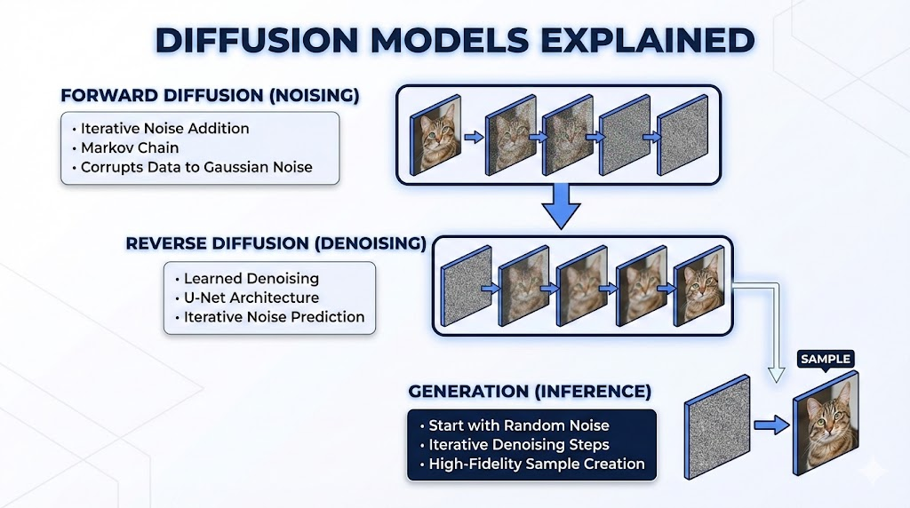

# **From Static to Masterpiece: The Engineering Logic of Diffusion Models**

## **The 10-Second Insight**

Diffusion models generate high-fidelity data by learning to systematically reverse a process that turns structured images into random Gaussian noise.

## **Why It Matters**

* **Superior Training Stability:** Unlike Generative Adversarial Networks (GANs), diffusion models use a stationary training objective that avoids "mode collapse" and the need for delicate balance between two competing networks.
* **Unmatched Sample Diversity:** These models effectively cover the entire distribution of the training data, producing more varied and creative outputs than previous generative architectures.

## **The Core Pillars**

* **Forward Diffusion (The Noising Chain):** This process incrementally adds Gaussian noise to a clean image over a series of steps until the original data is completely destroyed. This provides the mathematical framework for the model to understand what "degradation" looks like at various scales.
* **Reverse Diffusion (Iterative Denoising):** A neural network—typically a **U-Net**—is trained to predict and remove the noise added at each step. By starting with pure random static and iteratively subtracting predicted noise, the model "recovers" a clean, structured image from chaos.
* **Conditioning and Schedulers:** **Schedulers** define the rate and intensity of noise removal, while **Conditioning** (often via CLIP embeddings) guides the denoising process. This ensures the model converges toward a specific visual result that matches a provided text prompt or image reference.

## **Real-World Analogy**

Imagine a master sculptor looking at a pile of fine sand. Instead of carving away stone, they have memorized exactly how the wind scatters sand over time; they simply reverse the wind's path in their mind to pull the grains back together into a perfect statue.

## **The Bottom Line**

Diffusion models trade high computational cost for unparalleled image quality and training reliability, establishing a new foundation for the generative AI era.
