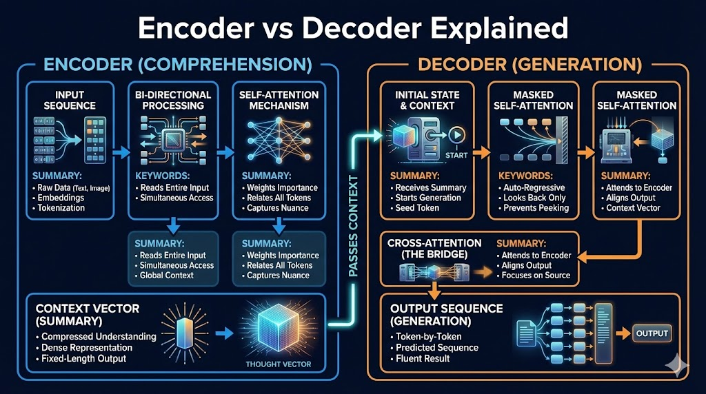

# **The Duet of Data: Demystifying Encoder vs. Decoder**

## **The 10-Second Insight**

While the **Encoder** compresses raw input into a rich mathematical "understanding," the **Decoder** takes that understanding and unrolls it into a human-usable output.

## **Why It Matters**

* **Contextual Understanding:** Encoders capture the nuance of a whole sentence at once, preventing the model from losing the "big picture."
* **Generative Power:** Decoders allow machines to predict the next logical token, turning abstract data into fluent text, code, or images.

## **The Core Pillars**

1. **Bi-Directional Context (Encoder):** The Encoder looks at the entire input sequence simultaneously. It uses **Self-Attention** to understand how every word relates to every other word, creating a dense "Context Vector."
2. **Auto-Regressive Generation (Decoder):** Unlike the Encoder, the Decoder is "masked." It generates tokens one-by-one, using previously generated words as context to predict the next word in the sequence.
3. **Cross-Attention (The Bridge):** This is the "handshake" where the Decoder looks back at the Encoder’s output. It ensures the generated output (e.g., a French translation) stays perfectly aligned with the original input (e.g., English text).

## **Real-World Analogy**

Think of a **Courtroom**. The **Encoder** is the court reporter who listens to the entire testimony and summarizes it into a dense, factual brief. The **Decoder** is the judge who reads that brief and, word-by-word, dictates a final, coherent verdict based on those facts.

## **The Bottom Line**

The Encoder is for **comprehension** and the Decoder is for **creation**; together, they form the engine that allows AI to both "read" and "write."
