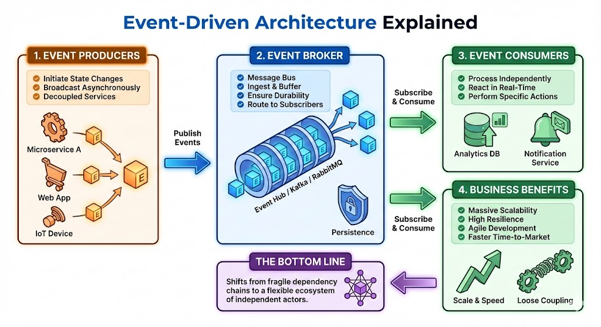

# From Chains to Triggers: Why Event-Driven Architecture is the Modern Backbone

## The 10-Second Insight

Event-Driven Architecture (EDA) decouples services by allowing them to communicate through asynchronous "events," enabling massive scalability and resilience that traditional request-response systems can't match.

## Why It Matters

* **Eliminates Tight Coupling:** Services no longer need to know the location or status of other services to function, preventing "distributed monolith" headaches.
* **Scales Under Pressure:** Systems can handle sudden traffic spikes by buffering events in a queue rather than crashing under synchronous load.
* **Real-Time Agility:** Enables businesses to react to data the moment it happens (e.g., fraud detection) instead of waiting for batch processing.

## The Core Pillars

1. **The Event Producer:** This is the source of truth that captures a state change (e.g., "Order Placed") and emits it as a message. It doesn't care who consumes the message or what they do with it; its only job is to broadcast the fact.
2. **The Event Broker:** The "middleman" (like Kafka or RabbitMQ) that ingests, stores, and distributes events. It ensures **persistence and durability**, meaning if a downstream service is down, the event stays safe in the broker until the service recovers.
3. **The Event Consumer:** These are the independent services that subscribe to specific event types. Because they are **asynchronous**, multiple consumers can process the same event for different purposes (e.g., one for shipping, one for analytics) without slowing each other down.

## Real-World Analogy: The Restaurant vs. The Buffet

In a **Request-Response** system (Restaurant), you sit and wait for a waiter to take your order and bring it back; if the waiter is busy, you starve. In an **Event-Driven** system (Buffet), the chefs (Producers) simply keep the trays full (Broker), and hungry customers (Consumers) grab what they need when they are ready—nobody has to wait on anyone else to keep the line moving.

## The Bottom Line

Event-Driven Architecture shifts your system from a fragile chain of dependencies to a flexible ecosystem of independent actors, making "scale" a feature rather than a challenge.