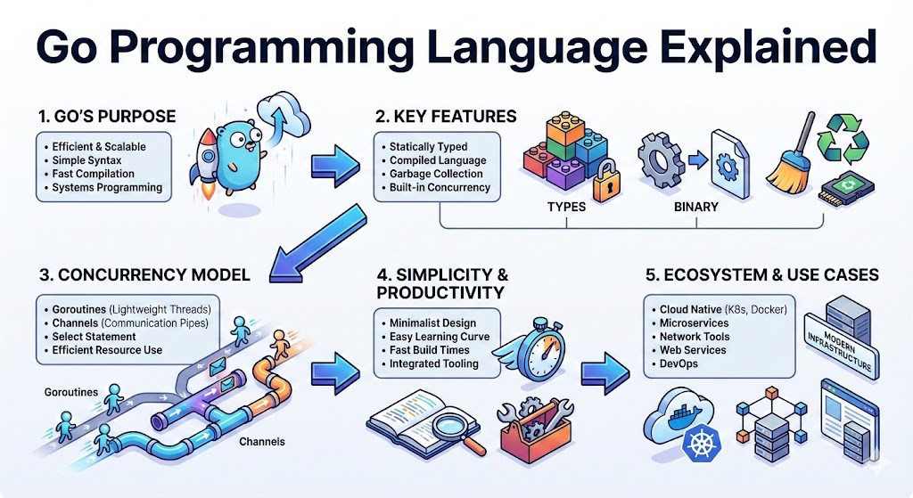

# **Go: The Blueprint for High-Scale Simplicity**

## **The 10-Second Insight**

Go (Golang) is an open-source language designed by Google to combine the execution speed of C++ with the development productivity of Python, specifically optimized for multi-core, networked systems.

## **Why It Matters**

* **Conquers Complexity:** It eliminates the "feature creep" of older languages, reducing technical debt and onboarding time for large engineering teams.
* **Born for the Cloud:** Its native support for concurrency and small binary sizes makes it the industry standard for microservices, Docker, and Kubernetes.
* **Blazing Performance:** As a compiled language with an efficient garbage collector, it provides near-instant startup times and high-throughput execution.

## **The Core Pillars**

1. **Goroutines (Concurrency):** Unlike heavy OS threads, Goroutines are "lightweight threads" managed by the Go runtime. You can spawn millions of them simultaneously with minimal memory overhead (starting at just 2KB).
2. **Composition Over Inheritance:** Go rejects complex class hierarchies. Instead, it uses **Interfaces** and **Struct Embedding**, allowing you to build flexible systems by describing *what* an object can do rather than *what* it is.
3. **Static Binaries:** The compiler packages all dependencies into a single, executable file. This simplifies deployment significantly, as you don't need to worry about shared libraries or "it works on my machine" environment issues.

## **Real-World Analogy**

Imagine a traditional language is a **massive construction crew** where every worker needs their own heavy truck (OS Thread) to move one brick. **Go** is like a fleet of **agile bicycle couriers**; they can weave through traffic, share the same road efficiently, and get the job done with a fraction of the fuel and space.

## **The Bottom Line**

Go is the language of choice for modern infrastructure because it prioritizes readability and "boring" code over cleverness, ensuring systems remain maintainable at massive scale.
