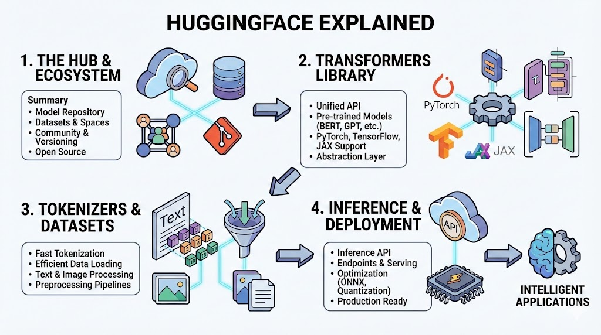

# **Hugging Face: The Standard Library of the AI Revolution**

## **The 10-Second Insight**

Hugging Face is the central infrastructure and community hub that provides standardized tools, pre-trained models, and datasets to make state-of-the-art Machine Learning accessible to every developer.

## **Why It Matters**

* **Ends Fragmented Workflows:** It replaces the "wild west" of custom scripts with standardized APIs for NLP, Vision, and Audio.
* **Eliminates "Cold Start" Problems:** Developers can leverage billions of dollars in pre-trained compute rather than training models from scratch.
* **Democratizes SOTA Research:** It bridges the gap between academic papers and production-ready code in a matter of days.

## **The Core Pillars**

* **The Model Hub (Git-based Versioning):** A central repository where millions of pre-trained models are hosted with built-in version control. It treats model weights like source code, allowing for collaborative fine-tuning and easy rollback.
* **The Transformers Library (Abstraction Layer):** A high-level API that abstracts the complexity of PyTorch, TensorFlow, and JAX. You can switch between different model architectures (like BERT, GPT, or Llama) by changing only a few lines of code.
* **Datasets & Tokenizers (Data Pipeline):** A highly optimized suite for loading massive datasets and converting raw text/images into machine-readable tensors. These libraries handle memory-mapping and heavy-duty processing with minimal RAM overhead.

## **Real-World Analogy**

Think of Hugging Face as **GitHub combined with NPM for Artificial Intelligence.** While the Hub hosts the "source code" (the weights), the Transformers library is the "package manager" that allows you to install and run intelligence with a single command.

## **The Bottom Line**

Hugging Face has successfully transformed Machine Learning from a specialized research field into a standardized engineering discipline.
