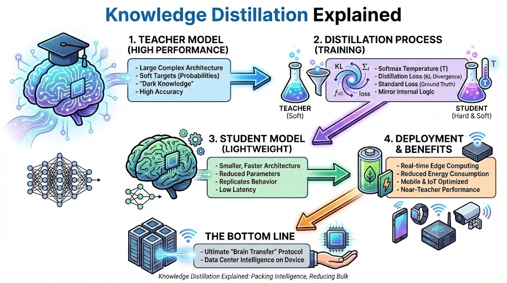

# **Passing the Torch: The Engineering Logic of Knowledge Distillation**

## **The 10-Second Insight**

Knowledge Distillation is a model compression technique where a small "Student" network is trained to reproduce the behavior and dark knowledge of a large, high-performance "Teacher" model.

## **Why It Matters**

* **Performance Without the Bulk:** It allows lightweight models to achieve accuracy levels near those of massive architectures, making them viable for real-time edge applications.
* **Reduced Latency:** By transferring learned patterns to a smaller parameter space, you significantly decrease inference time and energy consumption on mobile or IoT devices.

## **The Core Pillars**

* **Soft Targets & Temperature:** Instead of training on "hard" labels (0 or 1), the Student learns from the Teacher's **Softmax probabilities**. By applying a **Temperature** parameter to soften the distribution, the Student captures the "dark knowledge"—the subtle relationships between incorrect classes.
* **The Distillation Loss:** The training objective combines two signals: the standard loss against ground-truth labels and the **Kullback-Leibler (KL) Divergence** between the Student's and Teacher's outputs. This forces the Student to mirror the Teacher's internal logic and decision boundaries.
* **Architecture Agnosticism:** The Student does not need to be a smaller version of the Teacher; it can be an entirely different architecture. This flexibility allows engineers to distill a massive Transformer into a highly optimized, hardware-friendly Convolutional Neural Network (CNN) or a shallower MLP.

## **Real-World Analogy**

Think of a world-renowned professor (Teacher) and a bright apprentice (Student). Rather than the apprentice just reading the final answers in a textbook, the professor explains their entire thought process and the nuances of why certain wrong answers are "almost" right, allowing the apprentice to gain years of wisdom in a fraction of the time.

## **The Bottom Line**

Knowledge Distillation is the ultimate "brain transfer" protocol, enabling us to pack the intelligence of a data center into the palm of a hand.
