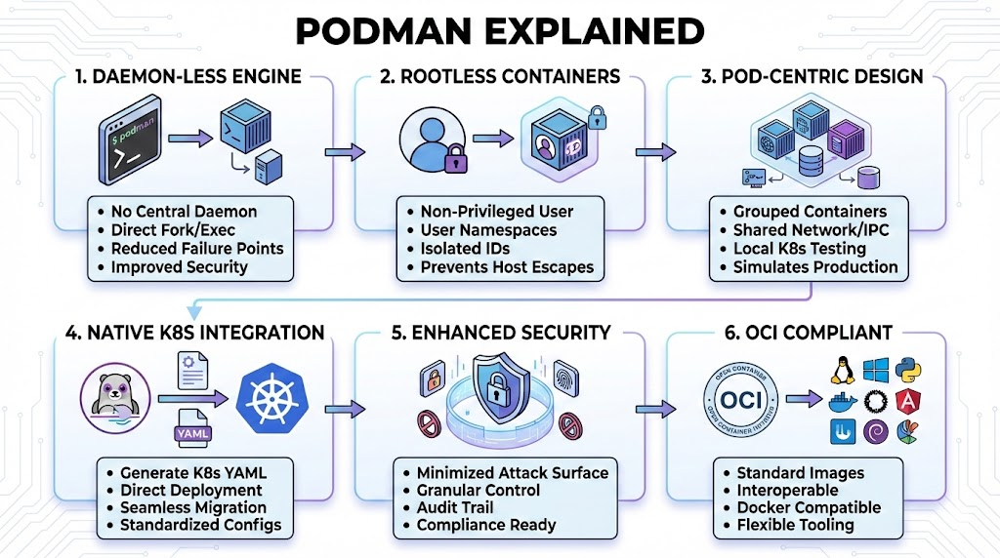

# Goodbye Root, Hello Podman: The Daemon-less Revolution

## The 10-Second Insight

Podman is a daemon-less, open-source container engine designed to develop, manage, and run OCI containers with a focus on security through rootless operations and Kubernetes compatibility.

## Why It Matters

* **Eliminates the Single Point of Failure:** Unlike Docker, Podman doesn't rely on a background daemon, meaning if one container crashes, it doesn't threaten the entire management engine.
* **Security First:** It allows users to run containers without **root privileges**, drastically reducing the attack surface and preventing container breakout exploits from gaining host-level control.
* **Native Kubernetes Integration:** Podman can generate and run Kubernetes YAML files directly, making the transition from local development to production clusters seamless.

## The Core Pillars

1. **Daemon-less Architecture:** Podman operates as a **fork/exec** model. Instead of a central service (the Docker Daemon) managing all containers, each container runs as a child process of the Podman command, integrated directly with the Linux kernel’s **systemd**.
2. **Rootless by Design:** It leverages **User Namespaces** to map the user's ID inside the container to a non-privileged ID on the host. This ensures that even if a process "escapes" the container, it has no administrative power over your machine.
3. **Pod-Centric Management:** True to its name (Pod Manager), it supports the concept of **Pods**—groups of one or more containers sharing the same network, storage, and IPC. This allows you to test multi-container applications locally exactly as they would run in a K8s environment.

## Real-World Analogy

Think of **Docker** like a **centralized restaurant kitchen** where one Head Chef (the Daemon) handles every single order; if the Chef gets sick, the whole kitchen shuts down. **Podman** is like a **high-end food court** where every stall (container) is independent; if one stall closes, the others keep serving, and no single person has the keys to every cash register.

## The Bottom Line

Podman delivers a more secure, modular, and Kubernetes-ready container experience by simply removing the "middleman" daemon and empowering the local user.
