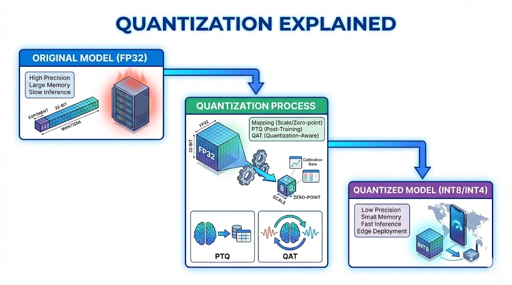

## **Shrinking the Giant: The Engineering Logic of Quantization**

## **The 10-Second Insight**

Quantization reduces the precision of a model's weights and activations—typically from 32-bit floating point to 8-bit integer—to drastically lower memory usage and accelerate inference without significant accuracy loss.

#### **Why It Matters**

* **Edge Deployment:** It enables massive Large Language Models (LLMs) to run on hardware with limited VRAM, such as mobile phones or local workstations.
* **Increased Throughput:** By reducing data width, quantization decreases memory bandwidth bottlenecks and allows hardware to perform more operations per second (TOPS).

#### **The Core Pillars**

* **Mapping via Scaling Factors:** The core mechanism involves mapping high-precision values () to a lower-precision range () using a **Scale** and **Zero-point**. This linear transformation ensures that the most critical statistical distribution of the weights is preserved.
* **Post-Training Quantization (PTQ):** This is a "set it and forget it" approach where a pre-trained model is converted using a small calibration dataset. It is computationally cheap and effective for most general-purpose applications.
* **Quantization-Aware Training (QAT):** For high-stakes precision, the model "learns" to compensate for rounding errors during the training phase. By simulating quantization noise in the loss function, the model maintains higher accuracy at ultra-low bit-widths like 4-bit or 2-bit.

#### **Real-World Analogy**

Imagine trying to describe a complex oil painting using only a 16-color box of crayons. You lose the subtle gradients of the original, but the subject remains perfectly recognizable, and the "data" is now small enough to fit on a postcard.

#### **The Bottom Line**

Quantization is the essential bridge that moves AI from massive data centers to efficient, localized execution on everyday,