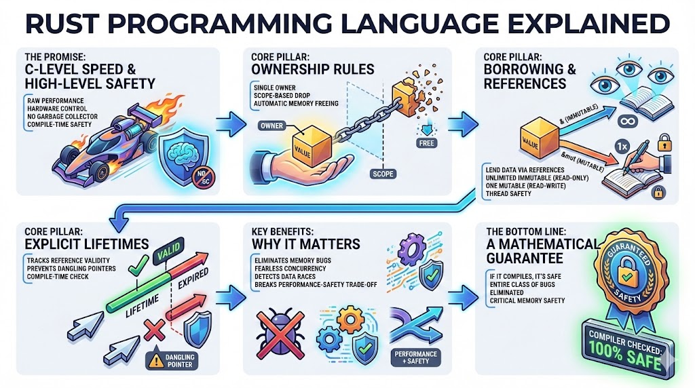

# Rust: The Impossible Promise of C-Level Speed with High-Level Safety

## The 10-Second Insight

Rust delivers the raw performance and hardware control of C or C++ by enforcing rigorous memory safety at compile-time, entirely eliminating the need for a runtime garbage collector.

## Why It Matters

* **Eliminating Memory Bugs:** Traditional systems languages allow devastating errors like buffer overflows and use-after-free bugs; Rust makes these architecturally impossible in safe code.
* **Fearless Concurrency:** Writing multi-threaded applications is notoriously difficult due to race conditions, but Rust's type system detects these data races before the code ever runs.
* **Breaking the Trade-off:** Historically, engineers had to choose between performance (C++) and safety (Java/Go); Rust proves you can finally have both without compromise.

## The Core Pillars

1. **Ownership Rules**
Every value in Rust has a single variable designated as its **owner**, and there can only be one owner at a time. When execution leaves the owner's scope, the value is immediately and automatically dropped (memory is freed).
2. **Borrowing and References**
Instead of passing ownership, you can lend data via **references**. You may have unlimited immutable references (read-only) *or* exactly one mutable reference (read-write) at any given moment, ensuring thread safety.
3. **Explicit Lifetimes**
The compiler uses **lifetimes** to track how long references remain valid, ensuring a reference never outlives the data it points to. This compile-time check prevents the dreaded "dangling pointer" bug.

## Real-World Analogy

Think of Rust's compiler as a hyper-strict librarian managing rare books (data). Only one person can hold the actual title deed (ownership). The librarian allows many people to look at the book in the reading room (immutable borrow), or lets exactly one person take it to a private room to annotate it (mutable borrow), but they will *never* let anyone look at a book that is scheduled to be destroyed (lifetime check).

## The Bottom Line

If you can get your code past the Rust compiler, you have a mathematical guarantee that an entire class of critical memory safety bugs simply does not exist in your application.