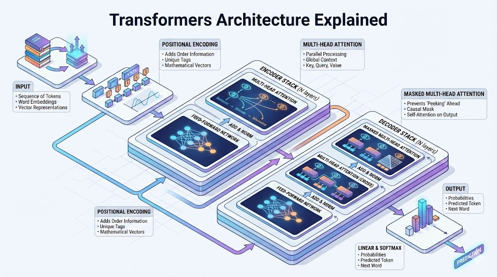

# **Attention is All You Need: The Transformer Revolution**

## **The 10-Second Insight**

Transformers replaced sequential processing with **parallel attention**, allowing models to understand global context across massive datasets simultaneously rather than piece-by-piece.

## **Why It Matters**

* **Eliminates Sequential Bottlenecks:** Unlike RNNs or LSTMs, Transformers process entire sequences at once, drastically reducing training time through GPU parallelization.
* **Solves Long-Range Dependencies:** They maintain perfect "memory" of the beginning of a document while processing the end, preventing the "vanishing gradient" problem.

## **The Core Pillars**

1. **Self-Attention Mechanism:** This allows the model to weigh the importance of different words in a sequence relative to a specific target word. It creates a dynamic map of "relevance," ensuring the word "bank" is linked to "money" in a financial context and "river" in a geographic one.
2. **Positional Encoding:** Since Transformers process all data in parallel, they lack an inherent sense of word order. This mechanism adds a unique mathematical vector to each input embedding to "tag" its position, preserving the structural meaning of the sentence.
3. **Multi-Head Attention:** Instead of looking at the sequence once, the model runs multiple "heads" of attention in parallel. Each head focuses on different relationship types, such as one tracking grammar and another tracking factual entities.

## **Real-World Analogy**

Imagine a **Cocktail Party**. Traditional models are like a single person trying to eavesdrop on every conversation one by one; they forget the start by the time they reach the end. A Transformer is like a high-tech microphone system that records everyone at once and uses "attention" to instantly isolate and link related whispers from opposite sides of the room.

## **The Bottom Line**

The Transformer shifted AI from local, sequential "reading" to global, parallel "understanding," forming the architectural backbone of every modern LLM from GPT-4 to Claude.
