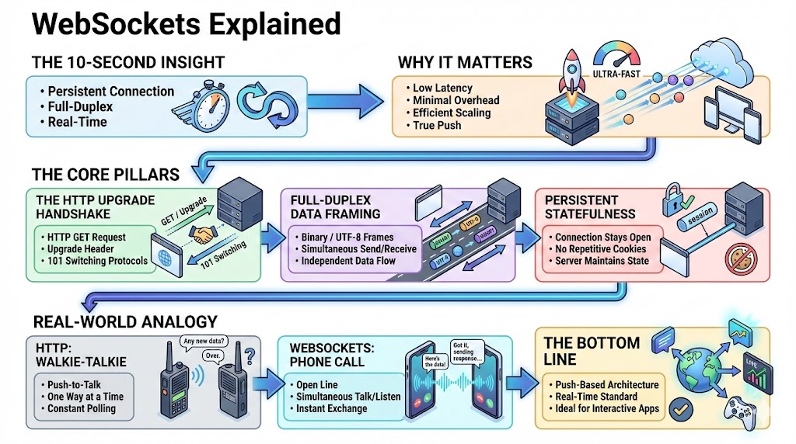

# Beyond the Request-Response Loop: Mastering WebSockets

## The 10-Second Insight

WebSockets provide a persistent, full-duplex communication channel over a single TCP connection, enabling real-time, bi-directional data exchange without the overhead of HTTP polling.

## Why It Matters

* **Eliminates Latency:** Unlike traditional HTTP, there is no need to open a new connection for every data packet, drastically reducing "wait time" for updates.
* **Efficiency at Scale:** By removing heavy HTTP headers from every message, WebSockets minimize bandwidth consumption and server CPU load.
* **True Real-Time Push:** Servers can push data to clients the millisecond it becomes available, rather than waiting for the client to ask for it.

## The Core Pillars

1. **The HTTP Upgrade Handshake:** Communication begins with a standard HTTP GET request containing an `Upgrade: websocket` header. If the server agrees, it responds with a `101 Switching Protocols` status, transforming the temporary HTTP link into a permanent WebSocket.
2. **Full-Duplex Data Framing:** Once established, data is sent in binary or UTF-8 "frames." Both the client and server can send these frames simultaneously at any time, independent of each other.
3. **Persistent Statefulness:** The connection remains open (stay-alive) until explicitly closed by either party. This allows the server to maintain a "state" for the user without relying on repetitive cookies or tokens for every message.

## Real-World Analogy

**HTTP** is like a **walkie-talkie**: You have to press a button to talk, and only one person can speak at a time; if you want an update, you have to keep asking "Anything new?" over and over.

**WebSockets** are like a **phone call**: Once the line is open, both people can talk and listen at the exact same time without ever having to redial.

## The Bottom Line

WebSockets shift the web from a "pull-based" architecture to a "push-based" reality, making them the non-negotiable standard for chat apps, live trading dashboards, and multiplayer gaming.
