# AI aslında zor değil

---

### Optimizasyon nedir?

- "Makine öğrenmesi" deyince aklına ne geliyor?
- Bir yığın matematiksel formüller, matrisler, fonksiyonlar, vb. mi?
- Ne kadar karmaşık gözükürse gözüksün; esasında tüm makine öğrenmesi algoritmaları, sinir ağları da dahil, aynı temel prensibe dayanır:

> Bir şeyleri optimize etmek.

---

* Peki, “optimizasyon” tam olarak ne demek?
* Bir şeyi optimize ettiğinde, **belirli kısıtlar içinde en iyi sonucu** elde etmeye çalışırsın.
* Diyelim ki cebinde **$A$ birim para** var.
* Canın çikolata istiyor ve çikolatanın tanesi **$B$ birim**. 
* Alabileceğin çikolata sayısı: $X = \frac{A}{B}$
* Ne kadar çok çikolata, o kadar çok mutluluk! 🍫
* O halde $X$ öyle bir sayı olmalı ki, **$A$ birim parayla en fazla sayıda çikolata** alabilesin.

> 🎯 **İşte $X$, optimize etmeye çalıştığımız parametredir.**

---

### Neden önemli?

* Optimizasyon, makine öğrenmesinde **hayati bir rol oynar.**
* Gözetimli öğrenmede amacımız, modelin **beklenen sonuç ile gerçek sonuç arasındaki farkı** en aza indiren parametreleri bulmaktır.
* Diyelim ki elimizde **görseller (feature) ve etiketlerden (label)** oluşan bir veri seti var.
* Hedefimiz, modele bir **kedi resmi** verdiğimizde onun da **“kedi”** tahmini yapmasıdır. 🐱

<!-- > 🎯 Modelin tahmini ile gerçeği arasındaki farkı **optimize ederek** bu hedefe ulaşırız. -->

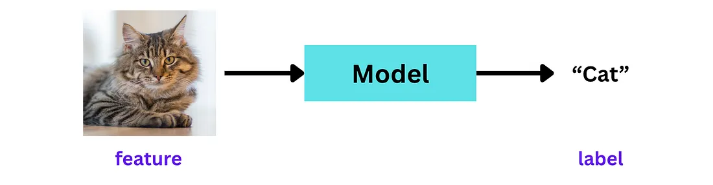

---

* Ama işin aslı şu: Model ilk başta **doğru tahmin yapamaz.**
* Diyelim ki elimizde 100 tane **kedi resmi** var. Model bunların çok azını, örneğin **20 tanesini doğru şekilde “kedi”** olarak etiketler.
* Geri kalanları mı? Model onlara **köpek**, **kuş** ya da bambaşka şeyler der.

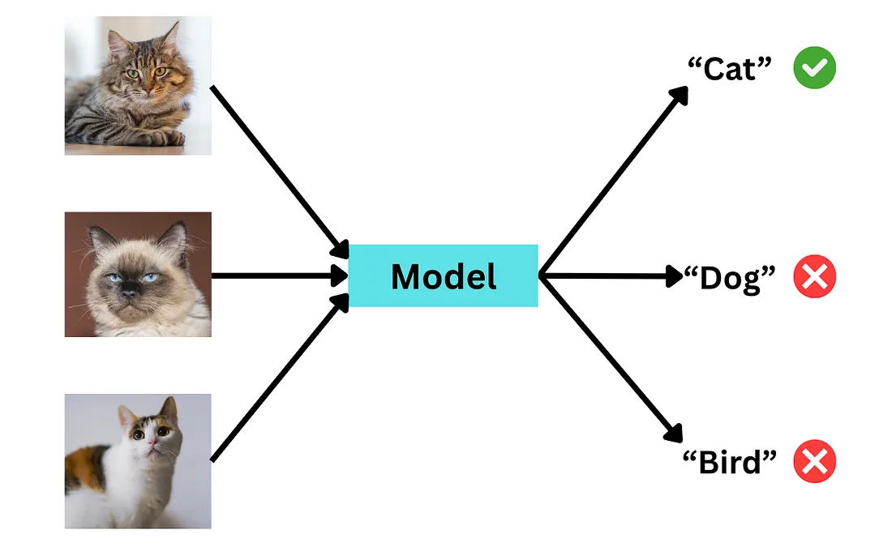

---

* Bu noktada bir **hata ölçüsüne** ihtiyacımız var.
* Bu hata olabildiğince **küçük** olduğunda, modelin doğruyu öğrendiğini anlarız.
* Bu hatayı en aza indirme süreci, doğası gereği bir **optimizasyon problemidir.**

---

### Nasıl optimize edilir?

* Modeli, ayarlanabilir **düğmelere** sahip bir makine gibi düşünebilirsin.

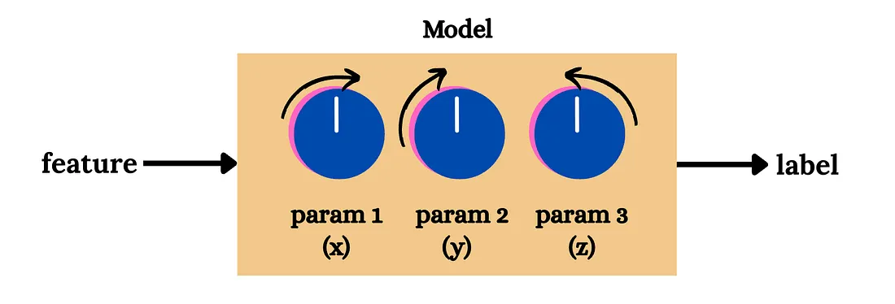

* Bu düğmeler, modelin **parametrelerini** temsil eder.
* Amacımız, bu düğmeleri öyle çevirmektir ki model her bir girdiye karşılık **doğru etiketi** tahmin edebilsin.
* Yani bu düğmeleri **hata en aza inene kadar** ayarlarız.

---

* Model, bir **girdi** alır ve buna karşılık bir **tahmin (etiket)** üretir.
* Modelin kendisi, $(x, y, z)$ gibi ayarlanabilir **parametrelerin bir fonksiyonudur:**

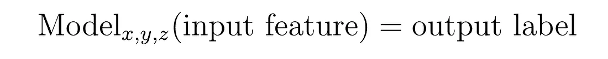

* **Tahmin hatası**, beklenen çıktı (gerçek etiket) ile modelin ürettiği tahmin arasındaki **farktır:**

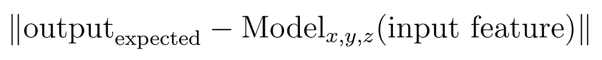

* **Toplam kayıp (loss)**, elimizdeki tüm eğitim örnekleri için bu hataların **toplamıdır:**

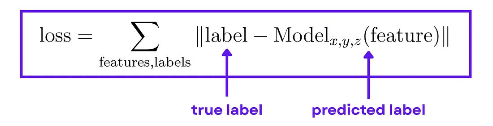

> Amaç: **model parametrelerini ayarlayarak bu toplam kaybı en aza indirmektir.**

---

### Optimizasyon probleminin genel hali

* Genel olarak bir **optimizasyon problemi**, bir **amaç fonksiyonunu** $f(x)$ en küçük ya da en büyük hale getirmeye çalışır.

* Buradaki değişken $x$, **değiştirip ayarlayabildiğimiz** şeydir.

* Matematiksel olarak şöyle yazarız:

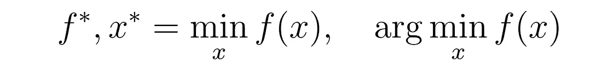

* Burada $f(x)$'in minimumu, fonksiyonun alabileceği **en küçük değeri**, **argmin** ise bu en küçük değeri veren $x$ değerini gösterir.

---

* Optimizasyon yaparken, bazen belirli **kısıtlar (constraints)** da bulunur.

* Bu kısıtlar, $f(x)$'i optimize ederken uymamız gereken **sınırları** belirler.

* Örneğin:

  * **Eşitsizlik kısıtları:** $g(x) \le 0$
  * **Eşitlik kısıtları:** $h(x) = 0$

* Genel olarak bir optimizasyon problemi şu şekilde ifade edilir:

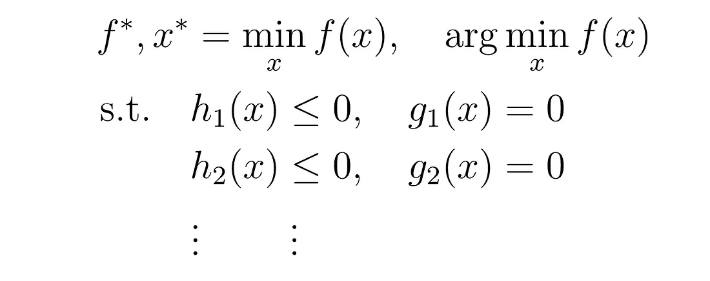

* Şimdi tüm bu sürecin nasıl işlediğini anlamak için **daha basit bir örneğe** dönelim.

---

### Basit bir örnek: En düşük sıcaklığı bulmak

* Diyelim ki tek boyutlu bir düzlem üzerindeyiz.
* Sıcaklık $(T)$, bu düzlem boyunca **konuma $(x)$ göre değişiyor.**
* Sıcaklık ve konum denklemi şu şekilde verilmiş olsun: $T(x) = x^2 - 6x + 11$ ve $x \ge 0$

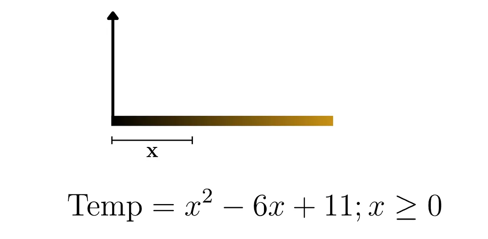

> Soru: **Sıcaklığın en düşük olduğu konumu nasıl buluruz?**

---

* Denklemi $(x - 3)^2 + 2$ biçiminde yeniden yazalım:

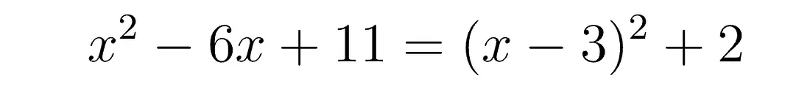

* $(x - 3)^2 + 2 \ge 0$ olması gerekir (üslü ifadeye dikkat).
* Öyleyse $x = 3$ için bu denklemin **minimum değerini buluruz**:

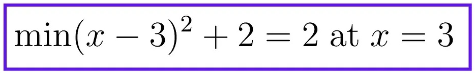

* Yani cevabımız $T(3) = 2$ olmalıdır.

---

* Denklemin grafiğini **yukarı açık bir parabol** olarak çizebiliriz.
* Sıcaklığın $x=3$ konumunda minimum olduğu $T(3) = 2$ noktasını grafikte gösterelim:

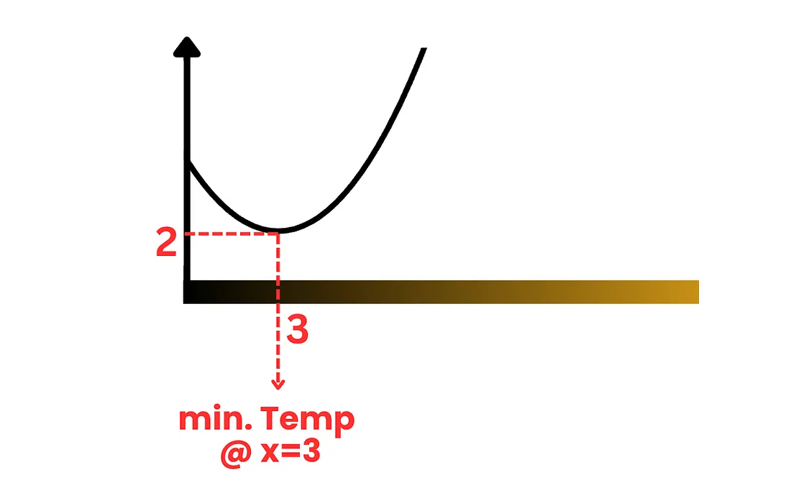

---

### 2 Boyutlu örnek

* Şimdi **2 boyutlu** bir problem deneyelim.
* Diyelim ki sıcaklık, bu kez **2 boyutlu bir düzlem** üzerinde konuma göre değişiyor.

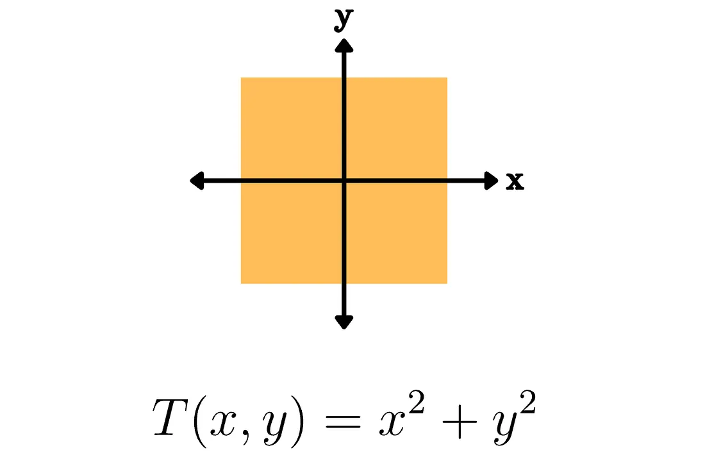

---

* Amacımız: $x + y \ge 1$ koşulu altında levha üzerindeki **en düşük sıcaklığı** bulmak.
* Optimizasyon denklemimiz şöyle yazılabilir:

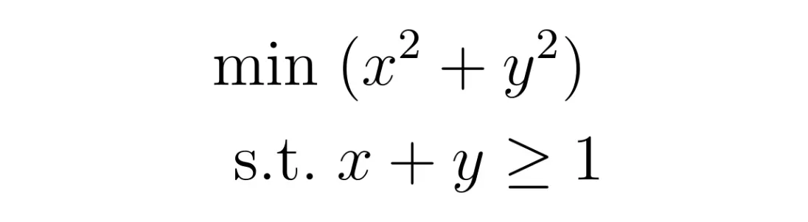

* Adım adım çözelim.

---

* **Adım 1:** Kısıt bölgesini çiz: $x + y \ge 1$. 
* Minimumu, **yalnızca bu bölgede** arıyoruz.

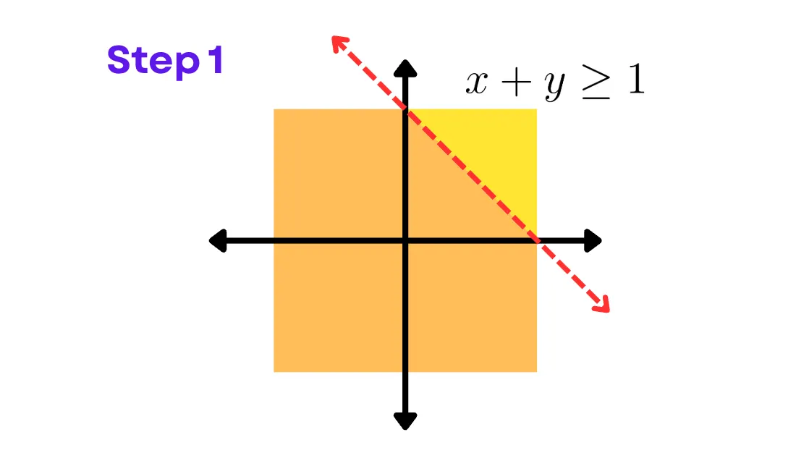

---

* **Adım 2:** Konturları (seviye eğrileri) çiz: $x^2 + y^2 = c$. 
* Daire **ne kadar küçükse**, amaç fonksiyonunun değeri o kadar **küçüktür**.

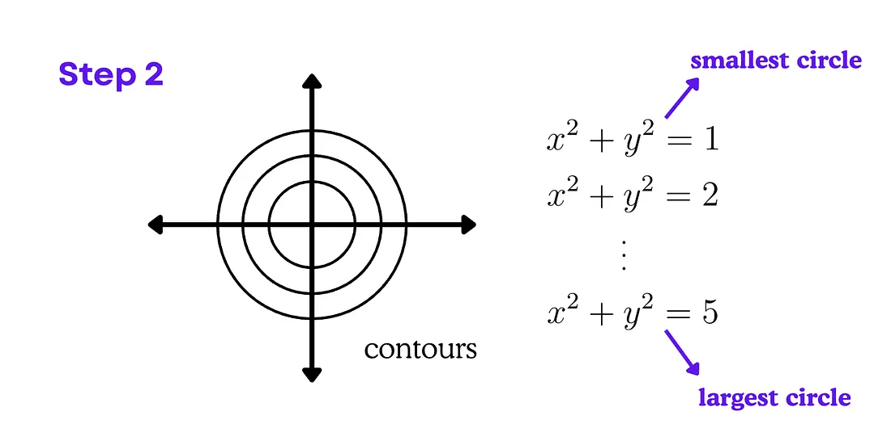

---

* **Adım 3:** Kısıt bölgesine **değen/en küçük** daireyi bul.

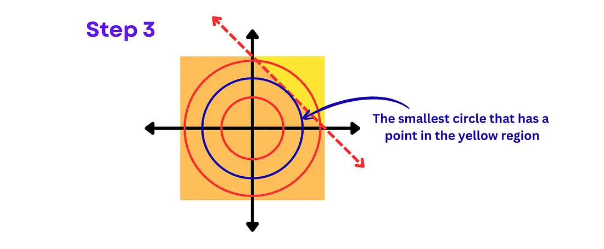

---

* **Optimal çözüm:**

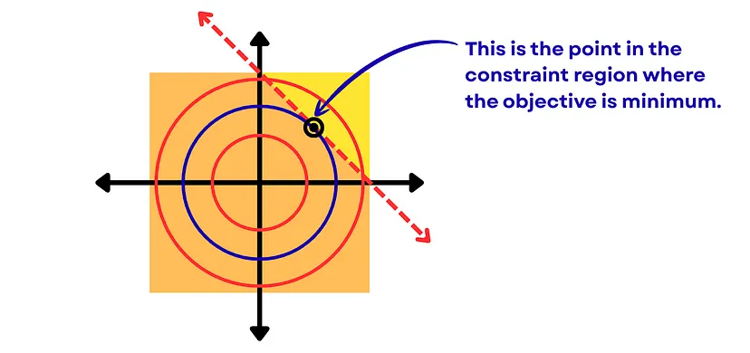

---

* Geometriden yararlanarak sıcaklığı hesaplayalım:

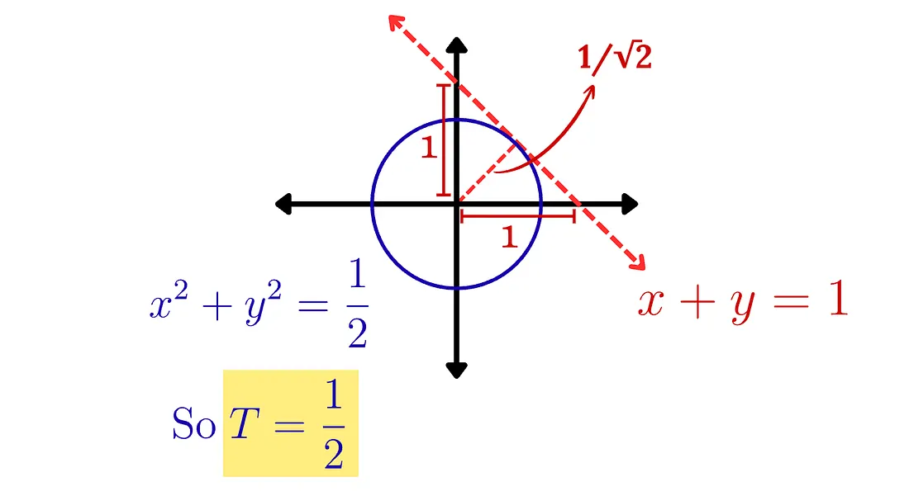

---

* En yakın nokta $x=\frac{1}{2}, y=\frac{1}{2}$.
* Yarıçap $r = \sqrt{\left(\frac{1}{2}\right)^2 + \left(\frac{1}{2}\right)^2} = \frac{1}{\sqrt{2}}$.
* $T = x^2 + y^2 = r^2 = \frac{1}{2}$ olduğundan, kısıt bölgesinde **minimum sıcaklık $\frac{1}{2}$** ve bu, $\left(\frac{1}{2}, \frac{1}{2}\right)$ noktasında gerçekleşir.

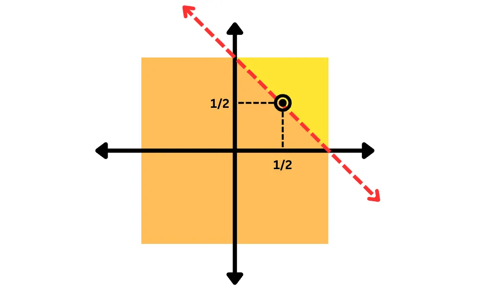

---

Buraya kadar özetlersek:

- **Optimizasyon:** Verilen amaç fonksiyonunu, belirli kısıtlar altında minimum (veya maksimum) noktaya getirecek parametreleri hesaplamaktır.
- Burada **amaç fonksiyonu** olarak kastettiğimiz şey, **modelin tahmin başarısını ölçen fonksiyondur.**.
- Yani amaç fonksiyonunu optimize etmek, aslında modeli daha başarılı tahminler yapar hale getirmektir.

---

### Sorun: Görselleştirme yetmediğinde

* İşte burada bir sorun ortaya çıkıyor.
  Bir fonksiyonun **konturlarını veya şeklini görselleştirmek** her zaman kolay değildir — özellikle de **yüksek boyutlarda.**
* Hatta bazı fonksiyonlar, **2D veya 3D’de bile** görselleştirmesi oldukça zordur.
* Ancak, bu tür fonksiyonları yine de optimize etmemize yardımcı olan **türev alma tabanlı algoritmalar** vardır.
* Derin öğrenmenin temelini oluşturan **Gradient descent** algoritması, işte tam olarak böyle bir algoritmadır.
--- 

* Bu yöntemler, amaç fonksiyonunu **küçülten yönde küçük adımlar atarak**, **tekrarlamalı biçimde en iyi çözüme** yaklaşır.

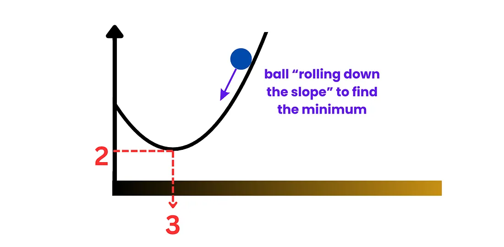

---

### Sonuç

* Bu sunumda, **optimizasyonun ne olduğunu** ve **makine öğrenmesi için neden temel** bir kavram olduğunu ele aldık.
* Makine öğrenmesinin özünde bir **optimizasyon problemi** olduğunu gördük; bunu 1D ve 2D örneklerle görselleştirerek anlamaya çalıştık.
* Ana fikir şu:
  Her defasında bir ML modeli “öğrendiğinde”, aslında bir **optimizasyon problemi çözüyor.**
  Model, **kayıp (loss)** değerini en aza indirmek için **parametrelerini ayarlıyor.**

---

* Gerçek dünyada ise modellerin **milyonlarca, hatta milyarlarca parametresi** var ve bu kadar yüksek boyutlu uzayları görselleştirmek imkânsız.
* İşte bu noktada **Gradient Descent** gibi algoritmalar devreye giriyor.
* En heyecan verici nokta şu:
> **Optimizasyon**, makine öğrenmesindeki hemen her şeyin temelinde yatıyor. Bunu anlamak, yapay zekânın nasıl çalıştığını anlamanın **ilk adımı.**

------

### Gradient Descent Nedir?

* Gradient Descent (Gradyan İnişi), bir fonksiyonun **minimum noktasını** bulmak için kullanılan temel bir **optimizasyon algoritmasıdır**.
* Bu yöntem, fonksiyonun **türevini (gradyanını)** kullanarak, fonksiyonun **azalma yönünde küçük adımlar** atar.

> 🎯 Amaç: Fonksiyonun **en dik iniş yönünü** bulmak ve adım adım minimuma ulaşmak.

---

### Gradyan ne demek?

* Bir fonksiyonun **gradyanı**, o fonksiyonun en hızlı **artış yönünü** gösterir.
* Dolayısıyla **–gradyan**, fonksiyonun en hızlı **azalış yönünü** gösterir.
* Gradient Descent bu fikri kullanarak, her adımda parametreleri bu yönde günceller.

> Gradyan: Fonksiyonun “eğim vektörü”.  
> Negatif gradyan: “En dik iniş” yönü.

---

### Adım adım nasıl çalışır?

1. Rastgele bir başlangıç noktası seç: $x_0$
2. O noktadaki gradyanı hesapla: $\nabla f(x_0)$
3. Fonksiyonun azalma yönünde küçük bir adım at:
   $$
   x_{1} = x_{0} - \eta \, \nabla f(x_{0})
   $$
4. Bu işlemi, hata (veya fonksiyon değeri) **artık değişmeyene kadar** tekrar et.

> $\eta$ (eta): **Öğrenme oranı (learning rate)** — adımın büyüklüğünü belirler.

---

### Öğrenme oranı neden önemli?

* Eğer $\eta$ **çok küçükse**, minimuma ulaşmak **çok yavaş olur**.  
* Eğer $\eta$ **çok büyükse**, fonksiyonun minimum noktasını **kaçırabiliriz**.

> ⚖️ İyi bir öğrenme oranı, hızlı ama dengeli iniş sağlar.

---

### Görsel olarak düşünelim

* Bir topu, yüzeyi $f(x)$ olan bir dağdan aşağı yuvarladığını hayal et.  
* Top, her adımda eğimin en dik olduğu yönde hareket eder.  
* Yüzeyin şekline göre bazen **dalgalanabilir**, **sallanabilir** ama sonunda **minimum noktaya** yaklaşır.

> 💡 İşte Gradient Descent’in sezgisel karşılığı budur.

---

### Matematiksel güncelleme kuralı

Gradient Descent, her iterasyonda parametreleri şu şekilde günceller:

$$
\theta_{t+1} = \theta_t - \eta \, \nabla_{\theta} J(\theta_t)
$$

* $\theta$ → modelin parametreleri  
* $J(\theta)$ → kayıp (loss) fonksiyonu  
* $\nabla_{\theta} J(\theta)$ → kaybın parametrelere göre türevi  
* $\eta$ → öğrenme oranı  

> 🎯 Amaç: $J(\theta)$’yi minimuma indiren $\theta$ değerlerini bulmak.

---

### 2B örnek: yüzey üzerinde hareket

* Başlangıç noktası rastgele seçilir.  
* Her adımda gradyan yönü hesaplanır.  
* Nokta, en dik iniş yönünde hareket eder.  
* Nokta minimuma yaklaştıkça adımlar küçülür, sonunda dengeye ulaşır.

---

### Gradient Descent’in çeşitleri

| Tür | Açıklama | Özellik |
|-----|-----------|---------|
| **Batch Gradient Descent** | Tüm veri kümesiyle gradyan hesaplar. | Kararlı ama yavaş. |
| **Stochastic Gradient Descent (SGD)** | Her adımda tek örnekle günceller. | Gürültülü ama hızlı. |
| **Mini-Batch Gradient Descent** | Küçük veri gruplarıyla çalışır. | En yaygın kullanılan yöntem. |

---

### Optimizasyon yolculuğu

* Başta büyük adımlar atılır.
* Minimuma yaklaştıkça adımlar küçülür.
* Bazen **yerel minimumlara** takılabilir.
* Modern algoritmalar (Adam, RMSProp, vb.) bu sorunu **momentum** ve **uyarlamalı öğrenme oranları** ile çözer.

---

### Özet

- **Gradient Descent**, makine öğrenmesinin kalbinde yer alır.  
- Modelin parametrelerini, **kayıp fonksiyonunu en aza indirecek şekilde** günceller.  
- Her adım, **hata yüzeyinde en dik iniş yönünde** ilerlemektir.
- Doğru öğrenme oranı ve veri yaklaşımı, modelin başarıya ulaşmasını sağlar.

> 🎯 Kısacası: “Öğrenmek” = “Kayıp yüzeyinde optimize etmek”.

---

### Bonus: Sezgisel Analogi

* Bir öğrenci düşün: her sınav sonrası nerede hata yaptığını görüp notlarını düzeltiyor.
* Her düzeltme, küçük bir “gradyan adımıdır”.
* Zamanla, öğrenci (ve model) hatalardan öğrenir ve **en iyi versiyonuna** yaklaşır.

> 🤖 Gradient Descent, “yapay zekânın öğrenme şeklidir”.

---

