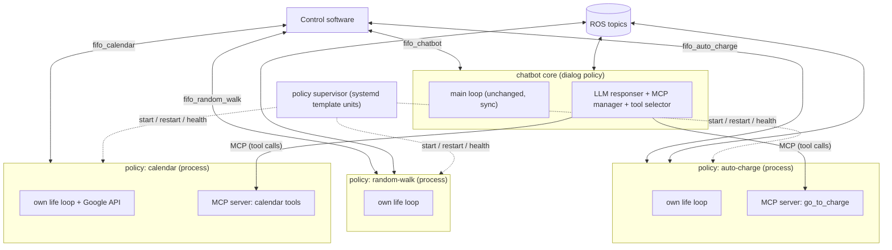
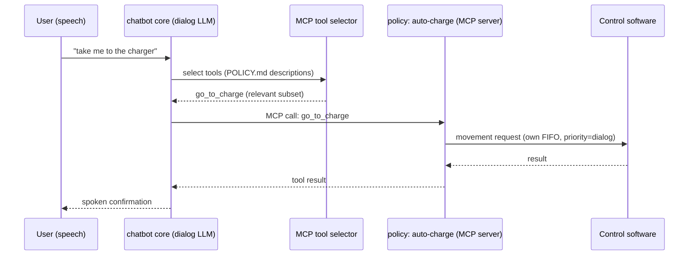
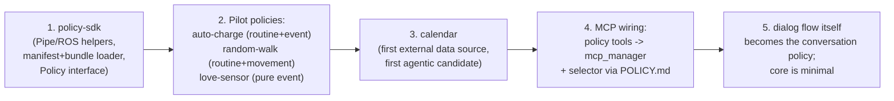

# Policy Architecture — Design Document

Refactoring the service layer into independently developed, deployed and
running **policies**, following Claude (plugin/skill) conventions.

> Status: agreed design, pre-implementation.
> Scope note: the chatbot core's synchronous main loop is explicitly **out of scope**
> for this refactor. This design is a deliberate step toward real-time behavior
> without touching that loop.

---

## 1. Context

The chatbot runs on a humanoid robot. Despite the name, it is effectively an
**LLM grounding application**: users command the robot through conversation, and the
LLM grounds those requests into robot actions (via MCP tool calls).

- The robot is built on **ROS**; an in-house **control software** owns the robot's
  resources and communicates with the chatbot over **FIFOs** (named pipes).
- Everything currently runs in a single synchronous loop (`chatbot/start.py`, ~50ms):
  - `run_fifo_data()` — dispatches FIFO packages by type to `on_*` handlers in
    `chatbot/service/` (`on_listen`, `on_battery_percent`, `on_lovesensor_change`, …).
  - `run_tick()` — periodic routines hardcoded inside `on_tick`: Google Calendar
    check, `auto_charge`, `clear_memory`, `random_walk`.
  - `run_feed_data()` — camera / object-detection ROS feeds.
- Services share state through a global `context` singleton plus module-level globals.
- Feature toggles/parameters live in a `BaseFunction`-based config
  (`context.config.has_func(...)`, `get_param_value(...)`).
- An MCP layer (`chatbot/llm/mcp/`) already exists — manager, client and a **tool
  selector** — but is only used for the dialog LLM's tool calls, configured from a
  central file.

### Problems with the current shape

- Services are not services: they are handler functions welded into one loop.
- A blocking call anywhere (speech ack waits up to 40s, `go_to_location`) freezes
  everything — far from real-time.
- Cross-service coupling through shared mutable state
  (e.g. `battery.py` writing `context.current_charge_status` directly).
- Adding or updating a feature requires touching and redeploying the whole service.

## 2. Goals and Decisions

| Topic | Decision |
|---|---|
| Scope | Full architectural change: tick routines, sensor handlers, and eventually the dialog flow itself |
| Unit of work | **Policy** = independently developed, versioned and deployed unit with its own data sources, flows, routines and prompt |
| Lifecycle | Each policy has a **fully independent life loop**, separated from the main loop |
| Runtime | Each policy is a **separate process** (own loop, own I/O), not a thread in the core |
| Data plane | Policies read/write **ROS and FIFO themselves** — this independence is the primary expectation of the refactor. **One FIFO pair per policy**, to be agreed with the control software team |
| Standard | **Claude conventions at the format level** (plugin/skill-like bundles, frontmatter markdown prompts, MCP) — runtime stays in-house and model-agnostic (gpt-4o, gemini, local model) |
| Anatomy | **Plugin-bundle**: a policy packages hooks (event reactions), skills (LLM-invoked capabilities), MCP tools, prompt and config together |
| Tool ownership | Tools move **into the policies**; the central MCP config remains only for external, policy-less servers |
| Intelligence | Policy flow stays deterministic code by default; `POLICY.md` governs how the LLM reads/uses the policy, and serves as the system prompt for optionally agentic policies |
| Compatibility | Clean slate allowed. Policies own their config; the legacy `BaseFunction` config is secondary |
| Speech | **Hybrid**: policies may speak directly (canned responses) or through the dialog LLM — but direct speech is always reported back so the LLM never loses context (speech ledger, §7.5) |
| Memory | The chatbot core is the **sole owner of conversation memory**; every utterance the robot makes — whichever policy produced it — is recorded there |
| Concurrency | Parallelism lives in the policies; all triggers **serialize at the chatbot's priority inbox** (Claude Code model: parallel tools, serial conversation loop) |
| Trust | **Registry whitelist**: only `policy_event`s from registered `src` names are processed |
| Management | No gateway process; thin management plane: registry + `policyctl` CLI + existing MCP tool selector |

## 3. Target Architecture



Key properties:

- **Data plane belongs to the policy.** Each policy talks to the control software
  over its **own FIFO pair** and joins ROS as its **own node**. There is no gateway
  in the data path — no bottleneck, no single point of failure.
- **The core becomes just another policy** — the dialog/grounding policy. Once tick
  routines move out, only the conversation flow remains; its main loop shrinks but
  does not change.
- **Independent lifecycles.** A policy blocking on a speech ack blocks only itself.

## 4. Policy Bundle Format (Claude conventions)

```
policies/auto-charge/
├── policy.json            # identity: name, version, description (plugin.json analog)
├── manifest.yaml          # triggers, io (fifo channels, ros topics), capabilities, execution
├── POLICY.md              # frontmatter: description ("when is this relevant")
│                          # body: behavior instructions / agentic system prompt
├── hooks/
│   └── on_battery.py      # deterministic event reactions
├── skills/
│   └── go-to-charge/
│       └── SKILL.md       # LLM-invoked capability (frontmatter + instructions)
├── tools/
│   └── charge_tools.py    # MCP tool implementations (exposed as the policy's MCP server)
└── config.yaml            # policy-owned user-editable parameters (thresholds, etc.)
```

Manifest sketch:

```yaml
name: auto-charge
version: 1.2.0
triggers:
  - type: interval
    every: 60s
  - type: event
    package: battery_percent
    delivery: latest        # latest | stream (see §6)
io:
  fifo: fifo_auto_charge    # contract with control software
  ros_topics: []
tools:
  - go_to_charge
mode: deterministic          # deterministic | agentic
```

The `io` section doubles as documentation **and** the contract with the control
software team.

### POLICY.md — two consumers, one file

1. **The dialog LLM** only ever sees the frontmatter `description` ("when to use"),
   fed into the existing MCP **tool selector** — with many policies, only the
   relevant subset of tools reaches the model (progressive disclosure, exactly the
   Claude Skills model). Full bodies are never dumped into the system prompt.
2. **The policy's own LLM** (agentic mode) uses the body as its system prompt.
   Deterministic policies keep the body short (tone/wording guidance only).

## 5. Data Plane and the Control Software Agreement

Each policy owns its I/O. Existing infrastructure (`Pipe`, `ROSPublisher`,
`CameraFeed`, `TopicListener`) moves into a thin, reusable **`policy-sdk`** package
so bundles stay small.

The per-policy FIFO agreement with the control team must cover:

1. **Channel convention** — naming standard (e.g. `/tmp/fifow_<policy>` /
   `/tmp/fifor_<policy>`); dynamic vs. registered channel setup. The package
   protocol already has a `dst` field; adding `src` identifies the policy.
2. **Broadcast semantics** — state packages (`battery_percent`,
   `controlstatusinfo`, …) should be copied to every subscribed policy channel;
   otherwise a package lands on one channel and other policies go blind.
3. **Resource arbitration** — with everyone writing speech/movement requests on
   their own channel, the natural arbiter is the **control software** (it owns the
   resources). A `priority` field on packages (`dialog > alert > ambient`) lets it
   resolve conflicts (e.g. `random_walk` must not move the robot while
   `auto_charge` is navigating to the dock; two policies must not speak at once).
   **Fallback** if the control team declines: a small lease/token coordinator that
   policies consult before speaking/moving — data still flows directly.

## 6. Event Delivery Semantics

Per-subscription `delivery` attribute in the manifest:

- `stream` — every package, in order (must-not-miss events: `barcode_read`, `listen`).
- `latest` — only the most recent value is kept; older ones are overwritten
  (state-like, high-frequency sources: battery percent, camera frames).

This keeps slow policies from ballooning memory/latency as the policy count grows.

## 7. Interaction Model

How policies and the chatbot core talk to each other, in both directions.

### 7.1 Policy → chatbot: the `policy_event` package

A policy that wants to reach the dialog LLM (e.g. a greeter policy spotting a person)
writes a `policy_event` package into the chatbot core's **existing inbound FIFO** —
named pipes support multiple writers, so no new channel is needed. The main loop
only learns one new package type (`on_policy_event` handler); it does not change.

```json
{
  "type": "policy_event",
  "src": "greeter",
  "kind": "turn_request",
  "priority": "ambient",
  "content": "Person detected at the door, face not recognized. Greet them.",
  "ttl": 30,
  "lang": "tr"
}
```

- `kind`: `turn_request` (ask the LLM to act/speak) | `notify` (context only) |
  `job_update` (progress/result of a long-running job, §7.3) |
  `speech_report` (record of a direct utterance, §7.5).
- The chatbot injects the content into the LLM turn as system context — the exact
  analog of hook output arriving as a `<system-reminder>` in Claude Code.

### 7.2 Concurrency: parallelism outside, serialization inside

The Claude Code model applies directly: tools and subagents run in parallel, but the
conversation loop is single — everything lands in one message queue and the model
processes one turn at a time.

- The chatbot core stays a **single turn-loop**. All triggers (user speech, policy
  events) collect in one **priority inbox**: `dialog > alert > ambient`.
- **Coalescing**: all pending `notify`/`ambient` events at turn start are handed to
  the LLM as one context block (like multiple system-reminders in one message) —
  three simultaneous policy triggers produce one informed turn, not three utterances.
- **TTL**: events that go stale in the queue are dropped (no greeting a person who
  was detected two minutes ago).
- **Preemption**: `dialog` always wins; an in-flight `ambient` utterance is cut via
  the existing `cancel_stream` mechanism when the user speaks.

Determinism is thus preserved *inside* the chatbot (single loop, single ordered
queue); nondeterminism shrinks to queue arrival order, which priority + TTL +
coalescing make behaviorally irrelevant.

### 7.3 Chatbot → policy: sync tools and async jobs

- **Short actions** ("set volume", "list calendar events"): plain MCP tool call,
  request/response — the policy MCP servers cover this as-is.
- **Long-running work** ("patrol the building", "go charge"): the MCP tool must not
  block. It returns immediately with `{job_id, status: "started"}` (202-Accepted
  pattern); the policy runs the job in its own loop and streams progress/results
  back as `policy_event {kind: "job_update"}`. The LLM sees "reached the dock" in a
  later turn and informs the user if appropriate. This mirrors Claude Code's
  background tasks (`run_in_background` + notification on completion).

MCP (request direction) and the `policy_event` inbox (result direction) are
complements; together they close the loop.

### 7.4 Querying policy status and state

`policy-sdk` bakes **standard management tools** into every policy's MCP server
(the analog of Claude Code's TaskList/TaskGet) — developers only implement the
`get_state` payload:

| Tool | Returns |
|---|---|
| `<policy>.status` | running/idle/error, uptime, last heartbeat |
| `<policy>.get_state` | policy-defined state summary (e.g. auto-charge: battery %, charging?) |
| `<policy>.list_jobs` / `get_job` | running/finished jobs and their results |

Division of labor: **MCP = application state, systemd/journal = process state**
(crashes, restart counts). They are not mixed.

### 7.5 Speech model: hybrid, with a speech ledger

Policies have two ways to make the robot speak:

- **Dialog path**: send a `turn_request` event; the LLM composes the utterance.
  Contextual speech, consistent tone, memory for free.
- **Direct path**: send a canned/template utterance straight to the control software
  over the policy's own FIFO (`priority=ambient`). Low latency, no LLM cost.

The critical constraint (this runs on a robot): **the robot must never speak without
the LLM being able to find out.** If a user notices the context break ("you just
greeted me — who are you?" met with ignorance), trust is lost. Therefore the SDK's
direct-speech API is **dual-write** and cannot be misused:

```python
api.speech.say_direct("Welcome!", lang="tr", priority="ambient")
# 1. speech package  -> control software (policy's own FIFO)
# 2. policy_event {kind: "speech_report", content: "Welcome!"} -> chatbot inbox
```

The chatbot records the report in conversation memory as a source-tagged assistant
turn (`[said via greeter]: "Welcome!"`). Combined with the memory decision above:
*the chatbot core is the sole owner of conversation memory, and every utterance the
robot makes flows into it* — dialog-path speech naturally, direct-path speech via
`speech_report`.

### 7.6 Trust model

The chatbot processes `policy_event`s only from `src` names present in the registry
(§9); packages from unknown sources are logged and dropped. No cryptography — a
whitelist is proportionate for the robot's closed environment.

## 8. LLM Grounding Integration

No new mechanism needed — the existing `mcp_manager` already connects to external
MCP servers:



- On startup the core scans `policies/` and connects to each bundle's MCP server.
- The central `MCP_CONFIG_PATH` file remains only for external, policy-less servers.

## 9. Deployment, Supervision and Management Plane

The management plane is deliberately thin — **no gateway process**. Data flows
directly (§5); management is three modest pieces:

- **Registry**: an inventory built by scanning bundle manifests under `policies/` —
  which policies exist, which FIFOs, tools and events they claim. Also performs
  conflict detection (two policies claiming the same FIFO name) and backs the
  `policy_event` whitelist (§7.6).
- **Supervision**: systemd template units — `ar-policy@auto-charge.service` — give
  restart, journal and health handling for free on the robot.
- **`policyctl` CLI**: `policyctl list / status / enable / disable / logs <name>` —
  a thin wrapper over systemd and the standard MCP management tools (§7.4). This is
  the human side of managing many policies.

LLM-side scaling is handled by the existing MCP tool selector (§8). If the policy
count ever makes per-policy MCP connections a burden, a single-endpoint **MCP
aggregator proxy** can be inserted later without changing any policy — this decision
is intentionally deferred.

- **Deploying a policy** = update its package (`uv add ar-policy-<name>` or drop the
  bundle in place) + `systemctl restart ar-policy@<name>`. The chatbot core is
  untouched.

Repository strategy: start as a monorepo with **separate distributions** per policy
(own version, own CI); split into separate repos later if needed. Deploy
independence is preserved either way.

## 10. Migration Plan



The three pilots cover the three policy archetypes; once they run as independent
processes against per-policy FIFOs, the pattern is validated.

## 11. Risks and Consciously Accepted Limits

- **Shared state disappears by design**: the `context` singleton is closed to
  policies. Robot state arrives via each policy's own channel; cross-writes like
  `context.current_charge_status = 2.0` are replaced by action results from the
  control software.
- **Ordering/determinism** decreases with independent loops. Broadcast events that
  concern everyone (`chatbot_reset`) require a mandatory `on_reset` lifecycle hook
  in every policy so resets stay coherent.
- **Arbitration is a hard dependency** on the control-team agreement (§5.3); the
  lease-coordinator fallback keeps the design shippable without it.
- **Process-per-policy costs** (memory, startup) are accepted in exchange for
  isolation and independent deploy; policies are I/O-bound, so this is cheap on the
  robot.
- **Memory growth**: recording every robot utterance (§7.5) grows conversation
  context; managed with TTL on events and the existing memory-clear/summarization
  mechanisms.

## 12. Open Points (to settle during implementation)

- ~~Is speech preemption allowed?~~ **Settled**: `dialog` always preempts `ambient`
  via `cancel_stream` (§7.2). Still open: how long an `ambient` utterance may wait
  in queue before its TTL drops it (default TTL values).
- Default `delivery` mode per event type (`latest` vs `stream`).
- Whether the control software or the fallback lease coordinator performs
  arbitration (pending the control-team discussion).
- `policy_event` schema finalization (exact field set, versioning of the package
  format).
