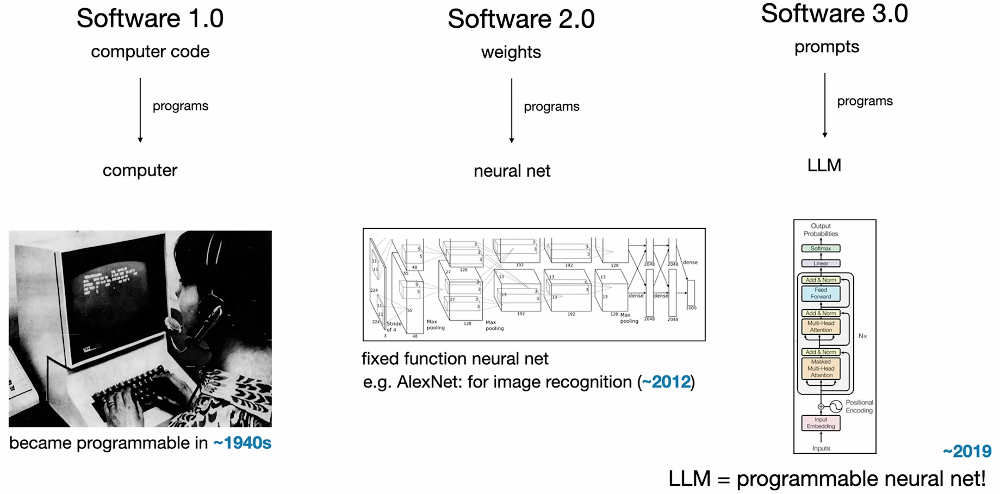
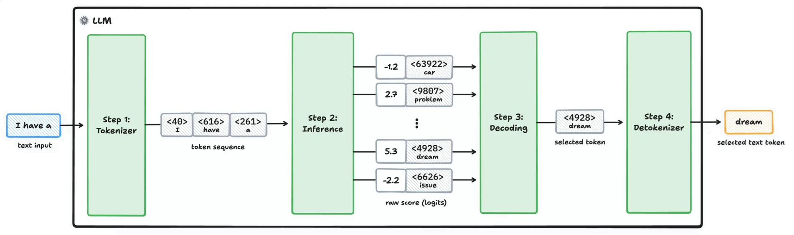
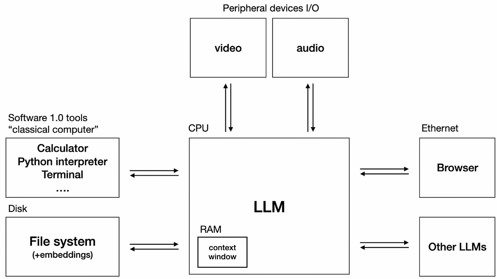

## :computer: Software 3.0
*Software engineering is changing, but how?*

---

<!-- footer: 18.09.2025 -->
<!-- header: :computer: Software 3.0 -->

### Content

**Talk:** ~20 min \
**QA:** ~5 min 

1. Fundamental level changing
2. Thinking about LLMs
3. Superpowers and cognitive deficits
4. Unlocking potential
5. Rise of the Vibe Coding
6. Vibe coding tools

 

> This presentation has been prepared from [Andrej Karpathy's "Software Is Changing (Again)"](https://www.youtube.com/watch?v=LCEmiRjPEtQ) presentation.

---

### 1. Fundamental level changing

---

### 1. Fundamental level changing

- **Software 1.0**
  - The **tradional programming language code**, like C++ or Python.
  - It operates based on explicit instructions, like `if`, `while`, `for` etc.
- **Software 2.0**
  - The **code is the weights of the neural network.**
  - Instead of explicit instructions, developers curate datasets and use training algorithms to **let the computer write the code (the weights) for itself**.
  - _**Neural networks are universal function approximators**, which means that they can adapt to a wide variety of tasks._
  - [HuggingFace](https://huggingface.co/) is the GitHub of the Software 2.0+. 
- **Software 3.0**
  - The **prompt** you provide to an LLM **is the program.**
  - In the LLM terms, **programming language is a natural language,** like English.

---

### 2. Thinking about LLMs

> *LLMs are autoregressive generators that iteratively selects the next token from a probability distribution to generate text.*

    

- But they are not just a text generator, they are also a complete and new-brand **computing platform.**
- They require immense upfront capital expenditure to train, and we access them via APIs on a pay-per-use basis, **similar to electricity.**

---

### 2. Thinking about LLMs

- **Think of LLMs as Operating Systems (OS).**
- For example: **interacting with ChatGPT is like using a terminal;** a universal, user-friendly GUI to operate the entire system.

    

---

### 3. Superpowers and cognitive deficits

- LLMs can recall a lot of information.
- Because they are perfect at **recalling the data they’ve been trained on.**
- During training, **they actually learn the cognitive patterns over this data.**
- As a result, LLMs can unexpectedly **perform tasks they weren’t explicitly trained for.**
- This phenomenon is called **emergent abilities**, and this is what allows an LLM to solve a problem when given a prompt.

*They seem nearly perfect, right?*

---

### 3. Superpowers and cognitive deficits

*...but there are dark sides of the LLMs!*

- **Hallucinations**
  - They confidently invent random facts.
- **Jagged Intelligence**
  - They can make absurd mistakes like *insisting "strawberry" has two "r"s*, or *9.11 > 9.9*, etc.
- **Anterograde Amnesia:**
  - They do not learn or grow from interactions.
  - **Their weights are fixed and the context window (working memory) is wiped clean after each generation session.**
- **Security Risks**
  - They are gullible and susceptible to prompt injection.

---

### 4. Unlocking potential

*Despite their flaws, you can unlock the LLMs potentials with a Human-AI collabration.*

- **Partial Autonomy**
  - You can manage your AI assisting coding with a simple **Generation-Verification loop.**
  - **AI generates the work and human must verify and correct it.**
- **Keep the AI on a Leash**
  - If you let the AI generate a massive, complex output, **the human becomes the bottleneck in reviewing it.**
  - It is far more efficient to **assign small, incremental tasks and keep the verification loop spinning fast.**

---

### 4. Unlocking potential

**Here is a simple AI-assisted coding workflow:**

1. Describe the single, next concrete, incremental change
2. Don't ask for code first, ask for approaches
  2.1. Pick an approach
  2.2. Ask for a draft code
  2.3. Make it explain then review it
  2.4. If not satisifed, try a different approach
3. Test it
4. Ask for suggestions on what could be implemented next
5. Repeat

---

### 5. Rise of the Vibe Coding

---

### 5. Rise of the Vibe Coding

- With LLMs, **anyone can create software based on a vibe**, without deep technical knowledge.
- **Everyone can now be a programmer in any programming language.**
- This dramatically **lowers the barrier** to entry for software development.
- This is called **vibe coding**.

---

### 6. Vibe Coding tools

---

Thanks!