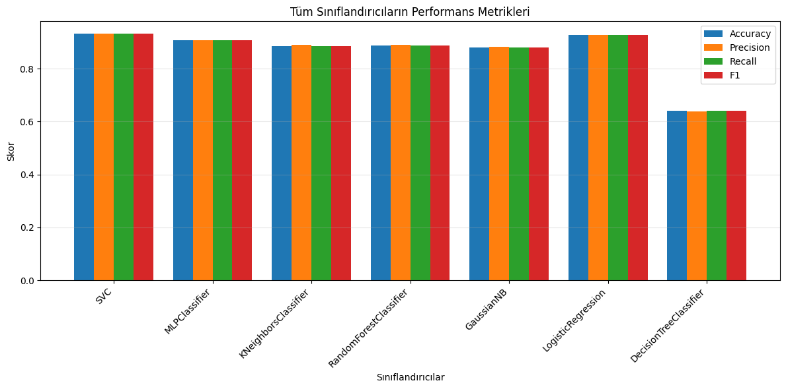
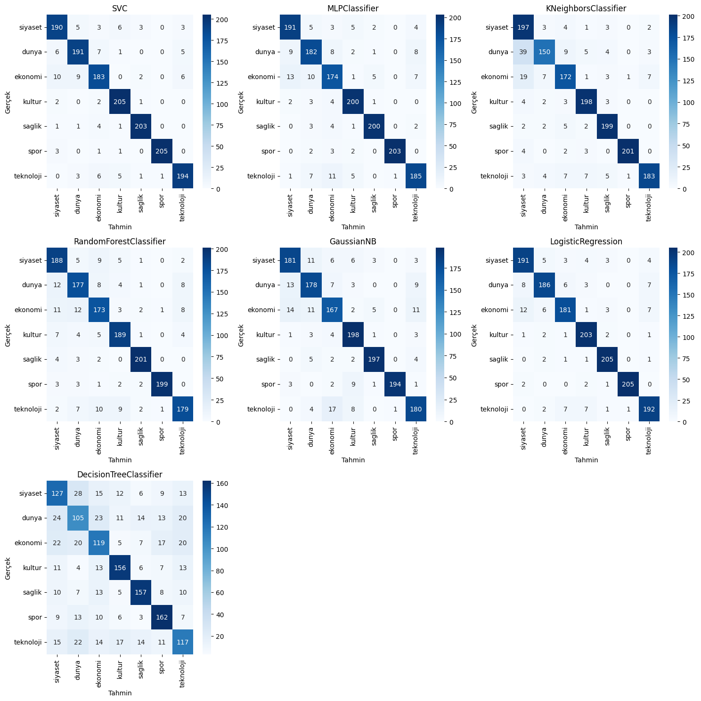

<!-- _class: lead -->
<!-- _paginate: false -->
<!-- _backgroundImage: url('https://marp.app/assets/hero-background.svg')  -->

# Embedding-Based Machine Learning Approach for Automatic Classification of Turkish News Articles

**Ahmet Atasoglu1, Yavuz Selim Taspinar2**

1Mechatronics Engineering Department, Selcuk University, Konya
 
<a href="mailto:258265001007@ogr.selcuk.edu.tr">258265001007@ogr.selcuk.edu.tr</a>, ORCID: 0009-0008-8178-2177

2Mechatronics Engineering Department, Selcuk University, Konya
 
<a href="mailto:ytaspinar@selcuk.edu.tr">ytaspinar@selcuk.edu.tr</a>, ORCID: 0000-0002-7278-4241

International Conference on Intelligent Systems and New Applications (ICISNA'25)

---

<!-- _class: lead -->
<!-- footer: 12.12.2025&nbsp;&nbsp;&nbsp;&nbsp;&nbsp;&nbsp;&nbsp;&nbsp;&nbsp;&nbsp;&nbsp;&nbsp;&nbsp;&nbsp;&nbsp;&nbsp;&nbsp;&nbsp;&nbsp;&nbsp;&nbsp;&nbsp;&nbsp;&nbsp;&nbsp;&nbsp;&nbsp;&nbsp;&nbsp;&nbsp;&nbsp;&nbsp;&nbsp;&nbsp;&nbsp;&nbsp;&nbsp;&nbsp;&nbsp;&nbsp;&nbsp;&nbsp;&nbsp;&nbsp;Embedding-Based Machine Learning Approach for Automatic Classification of Turkish News Articles-->

### Outline

1. Motivation
2. Introduction
3. Dataset and Preprocessing
4. Methodology
5. Classification Models
6. Experimental Results
7. Conclusion and Future Work

---

### 1. Motivation

- **Text classification** is one of the fundamental problem in Natural Language Processing (NLP).
- **Turkish language** presents unique challenges for NLP tasks due to its rich semantic features.
- **Deep learning embeddings** have revolutionized text representation by capturing semantic relationships
- **Traditional ML algorithms** can leverage these embeddings effectively without complex architectures

> **Research Goal:** Demonstrate that embedding-based representations combined with classical ML methods can achieve high performance for Turkish news classification

---

### 2. Introduction - NLP Evolution

**Natural Language Processing** enables computers to understand human language

## Evolution of NLP Approaches:
- **Rule-based Systems** → Hand-crafted linguistic rules
- **Statistical Methods** → Probabilistic models (N-grams, Hidden Markov Models, etc.)
- **Deep Learning** → Neural networks with automatic feature learning

## Key Technologies:
- **Word Embeddings:** Dense vector representations capturing semantic meaning
- **Pre-trained Language Models:** Transfer learning for downstream tasks:
  - BERT, GPT, Gemma, T5, BART, etc.

---

### 2. Introduction - Text Classification

## What is Text Classification?

Assigning predefined categories to text documents based on their content

## Applications:
- News categorization
- Sentiment analysis
- Spam detection
- Document organization
- Content moderation

> **Challenge:** How to effectively represent text for machine learning algorithms?

> **Solution:** Embeddings capture semantic meaning in continuous vector space

---

### 3. Dataset and Preprocessing

## Dataset: savasy/ttc4900
- **Source:** HuggingFace Datasets
- **Language:** Turkish
- **Total Samples:** 4,900 news articles

## Seven Categories:
1. Politics (Siyaset)
2. World (Dünya)
3. Economy (Ekonomi)
4. Culture (Kültür)
5. Health (Sağlık)
6. Sports (Spor)
7. Technology (Teknoloji)

## Data Split:
- **Training:** 70% (stratified)
- **Testing:** 30% (stratified)

## Preprocessing:
- **Minimal preprocessing** required
- Embeddings handle raw text
- Balanced distribution across categories
- Stratified sampling ensures class balance in both sets

---

### 4. Methodology - Embedding Generation

## Embedding Model: **embeddinggemma**

## Technical Details:
- **Framework:** Ollama
- **Output Dimension:** 768
- **Batch Size:** 16 elements
- **Processing:** Mini-batch structure

## Advantages:
✓ Captures semantic meaning
✓ Dense representation
✓ No manual feature engineering
✓ Pre-trained knowledge transfer

## Pipeline:

Text Document  
     ↓  
Embedding Model  
     ↓  
768-D Vector  
     ↓  
ML Classifier  
     ↓  
Category Label  

---

### 5. Classification Models

## Seven Models Evaluated:

1. **Support Vector Classifier (SVC)**
   - Kernel-based method

2. **Logistic Regression (LR)**
   - Linear classifier

3. **Multilayer Perceptron (MLP)**
   - Neural network

4. **K-Nearest Neighbors (KNN)**
   - Instance-based learning

5. **Random Forest (RF)**
   - Ensemble of trees

6. **Gaussian Naive Bayes (GNB)**
   - Probabilistic classifier

7. **Decision Tree (DT)**
   - Single tree classifier

## Experimental Setup:
- Default hyperparameters
- Fair comparison
- Same train/test split

---

### 6. Experimental Results - Performance Comparison

 
 

| Model | Accuracy | Precision | Recall | F1-Score |
|:------|:--------:|:---------:|:------:|:--------:|
| SVC | 93.27% | 93.27% | 93.27% | 93.26% |
| Logistic Regression | 92.72% | 92.73% | 92.72% | 92.70% |
| MLP | 90.82% | 90.85% | 90.82% | 90.82% |
| Random Forest | 88.84% | 88.97% | 88.84% | 88.88% |
| KNN | 88.44% | 89.11% | 88.44% | 88.42% |
| Gaussian NB | 88.10% | 88.23% | 88.10% | 88.12% |
| Decision Tree | 64.15% | 63.97% | 64.15% | 64.03% |

---

### 6. Experimental Results - Performance Metrics

---

### 6. Experimental Results - Confusion Matrix

---

### 6. Experimental Results - Key Findings

## Top Performers:
- **SVC achieved highest accuracy:** 93.27%
- **Logistic Regression very close:** 92.72%
- **MLP (Neural Network):** 90.82%

## Insights:

✓ **Linear/kernel-based methods excel** in high-dimensional embedding space

✓ **Tree-based methods** (RF, DT) perform moderately - struggle with continuous dense features

✓ **Single Decision Tree** significantly underperforms - insufficient complexity

✓ **High AUC values** across all classes for top models indicate strong discriminative power

---

### 6. Experimental Results - Analysis

## Why do SVC and Logistic Regression perform best?

1. **High-dimensional embeddings** are naturally suited for linear/kernel methods
2. **Continuous dense features** work well with these classifiers
3. **Semantic relationships** captured by embeddings enable clear class boundaries

## Why does Decision Tree underperform?

1. **Single tree structure** insufficient for complex embedding distributions
2. **Continuous features** don't align well with axis-parallel splits
3. **Lack of ensemble benefits**

## Confusion Matrix Observations:
- Strong diagonal values for SVC and LR
- Minimal cross-category confusion
- Embedding quality drives performance

---

### 7. Conclusion

## Main Findings:

✓ **Embedding-based representations are highly effective** for Turkish news classification

✓ **SVC and Logistic Regression** achieved >92% accuracy - best performers

✓ **Traditional ML algorithms can successfully leverage** deep learning embeddings

✓ **768-dimensional embeddings provide strong discriminative power** across seven categories

✓ **High-dimensional continuous spaces** favor linear/kernel-based methods

## Significance:
This study demonstrates that combining pre-trained embeddings with classical ML offers an effective and efficient approach for Turkish NLP tasks

---

### 7. Future Work

## Planned Improvements:

1. **Hyperparameter Optimization**
   - Grid search / Bayesian optimization for all models

2. **Alternative Embedding Models**
   - Compare BERT, RoBERTa, Mistral, mT5 embeddings

3. **End-to-End Deep Learning**
   - Fine-tune transformer models directly

4. **Data Augmentation**
   - Back-translation, synonym replacement

5. **Cross-lingual Experiments**
   - Multilingual models, transfer learning across languages

---

<!-- _class: lead -->

# Thank you for listening!

## Questions?
